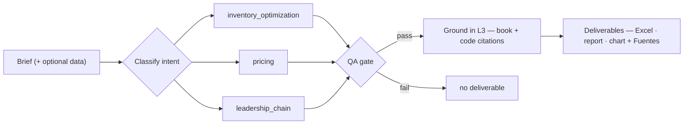

<div align="center">

# 🔗 Supply Chain Optimization

### From textbook inventory models to an agentic supply-chain brain.

A Python **engine** implementing Nicolas Vandeput's *Inventory Optimization: Models and Simulations* (2020) — EOQ, safety stock, `(s,Q)`/`(R,S)` policies, multi-echelon, simulation, forecasting and pricing — wrapped in an **orchestrator agent** that turns a plain-language brief into finished, QA-gated deliverables, each **grounded** in a knowledge graph of 17 SCM books and the codebase itself.

[](CHANGELOG.md)
[](pyproject.toml)
[](https://github.com/esstipi-debug/supply-chain-optimization/actions/workflows/tests.yml)
[](#)
[](LICENSE)

</div>


<div align="center"><sub>The live agent console (<code>webapp/static/prototype/</code>) talking to the real <code>POST /api/jobs</code>.</sub></div>

---

## ⚡ What it does

Give it a brief; it **classifies → runs → validates (QA) → delivers**. If QA fails, nothing ships.



| Capability | Input | Deliverable |
|---|---|---|
| 📦 `inventory_optimization` | demand CSV/Excel | Excel + report + CSV — forecast → `(s,Q)`/`(R,S)` → budget fit |
| 💲 `pricing` | price/qty CSV/Excel | Excel + report — elasticity → margin-maximizing price |
| 🧭 `leadership_chain` | a brief / scores | radar chart + report — CHAIN leadership profile + directives |

Runs **with or without an LLM**: an optional `LLMProvider` (Claude) sharpens routing and the narrative; the deterministic core works on its own. The whole thing is **211 tests, ~91 % coverage**.

---

## 🚀 Quick start

```bash
git clone https://github.com/esstipi-debug/supply-chain-optimization
cd supply-chain-optimization
pip install -r requirements.txt

# ── The agent: brief in, deliverable out ───────────────────────────────
python examples/run_agent.py --brief "set up reorder points" --data data/sample_demand_portfolio.csv
python examples/run_agent.py --brief "what price maximizes profit" --data data/sample_pricing.csv
python examples/run_agent.py --brief "evaluate our SC leadership" --scores "3 2 3 1 1" --name "Team"

# ── Web UI + live agent console ────────────────────────────────────────
pip install -r webapp/requirements.txt
python -m uvicorn webapp.app:app --reload
#   dashboard       → http://localhost:8000
#   agent console   → http://localhost:8000/console
```

> Set `ANTHROPIC_API_KEY` (and `pip install -e ".[llm]"`) to enable Claude-assisted parsing and narrative — optional.

<details>
<summary><b>📐 Engine CLIs — the book, chapter by chapter</b></summary>

```bash
# EOQ + policies + simulation on sample data
python examples/run_part1_part2.py --simulate

# Fill rate + optimal service level / review period (Ch. 7-8)
python examples/run_part3.py

# Gamma, GSM, newsvendor, KDE, simulation optimization (Ch. 9-13)
python examples/run_part4.py

# All SKUs in one CSV
python examples/run_batch.py

# Demand chart vs policy levels
python examples/plot_inventory.py --product SKU-A

# Full pipeline + exports
python examples/run_complete.py --simulate --export output/summary.csv --excel excel-templates/analysis.xlsx

# Power BI dataset (CSV star schema) — see power-bi/SETUP.md
python examples/build_powerbi_dataset.py --simulate

# Forecast demand from history, then derive the policy (uses sigma_e)
python examples/run_forecast_to_policy.py

# Full chain: source -> forecast -> policy -> budget/MOQ constraints
python examples/run_constrained_plan.py --budget 20000

# Live data: read demand from a SQL database instead of a CSV
python examples/run_sql_source.py

# Client deliverables from any CSV/Excel -> Excel + written report
python examples/run_inventory_job.py --data client_demand.csv --budget 50000 --client "Acme Co"
python examples/run_pricing_job.py   --data sales.csv --client "Acme Co"
```
</details>

---

## 🧠 The agent (`scm_agent/`)

A **registry-based orchestrator**: every capability is a `Tool` with four stages — `prepare → run → qa → deliver` — that the orchestrator drives, enforcing **"QA fails ⇒ no deliverable"** in one place. Adding a capability is one `register()` call; no routing edits.

```
brief ─▶ intent.classify ─▶ registry.get(tool) ─▶ prepare ─▶ run ─▶ QA ─▶ deliver ─▶ JobResult
              (rules + optional LLM)                inventory · pricing · leadership_chain
```

- **`scm_agent/`** — `types` · `llm` (Claude / rules fallback) · `registry` · `tools` · `intent` · `orchestrator` · `knowledge` (L3 grounding)
- **Entry points** — CLI `examples/run_agent.py`, HTTP `POST /api/jobs` (multipart, with downloadable deliverables), and the live console under `webapp/static/prototype/`
- **Statuses** — `ok` · `needs_clarification` · `needs_data` · `qa_failed` · `error`

Full reference: [`scm_agent/README.md`](scm_agent/README.md). The `leadership_chain` capability wraps the **CHAIN** model — *síntesis original inspirada en* From Source to Sold *(Palamariu & Alicke, 2022); no reproduce el texto del libro.*

---

## 🧠 L3 — domain knowledge & the theory↔code bridge

Every job is **grounded**: the orchestrator queries a knowledge graph and attaches citations to each result (the **Fuentes** shown in the console). Two graphs, one read-only query surface — [`scm_agent/knowledge.py`](scm_agent/knowledge.py):

- **Books graph** ([`knowledge/scm-books/`](knowledge/scm-books/README.md)) — **17 SCM books** (forecasting, pricing, revenue management, inventory — incl. **Vandeput**): 430 concept nodes with chapter citations. Committed.
- **Code graph** (`graphify-out/`) — the codebase itself, built with `/graphify`. Gitignored (regenerable).

The **bridge** ties them together: for each cited concept it resolves the `src/` module that implements it, so a deliverable cites the chapter **and** the function behind it.

```text
Economic Order Quantity           — Vandeput Ch.2  ->  src/eoq.py
Safety Stock                      — Vandeput Ch.4  ->  src/safety_stock.py
Cost & Service-Level Optimization — Vandeput Ch.8  ->  src/cost_optimization.py
```

Query it directly: `python examples/query_knowledge.py --bridge "newsvendor"` · `--search "fill rate"` · `--explain crostons_method`.

---

## 📐 The engine (Vandeput 2020)

The analytical core the agent stands on — every number is real, no Node/build step.

> **Source of truth:** Vandeput (2020). Official book code: [supchains.com/resources-invopt](https://supchains.com/resources-invopt) (password: `SupChains-IO`).

| Book section | Module | Status |
|--------------|--------|--------|
| Ch. 1 — Inventory policies | `src/policies.py` | `(s,Q)`, `(R,S)` |
| Ch. 2 — EOQ + volume discounts | `src/eoq.py` | ✅ §2.5.3 |
| Ch. 3 — Lead time & review period | `src/data_loader.py`, `src/eoq.py` | ✅ CSV + power-of-2 |
| Ch. 4 — Safety stock | `src/safety_stock.py`, `src/demand_variability.py` | ✅ normal + gamma |
| Ch. 5 — Simulation | `src/simulation.py` | ✅ backorders + lost sales |
| Ch. 6 — Stochastic lead time | `src/risk_period.py`, `src/policies.py` | ✅ |
| Ch. 7 — Fill rate | `src/fill_rate.py` | ✅ |
| Ch. 8 — Cost optimization | `src/cost_optimization.py` | ✅ |
| Ch. 9 — Gamma demand | `src/distributions.py` | ✅ |
| Ch. 10 — Multi-echelon GSM | `src/multi_echelon.py` | ✅ allocation + simulation |
| Ch. 11 — Newsvendor | `src/newsvendor.py` | ✅ |
| Price optimization | `src/pricing.py` | ✅ elasticity / optimal price / markdown |
| Ch. 12 — Histograms / KDE | `src/discrete_demand.py` | ✅ |
| Ch. 13 — Simulation optimization | `src/simulation_opt.py` | ✅ grid R + Ss |
| Batch multi-SKU | `src/batch.py` | ✅ |
| Demand forecasting (front-end) | `src/forecasting.py` | ✅ MA / SES / Croston + σ_e |
| Pluggable data sources | `src/sources.py` | ✅ CSV / DataFrame / SQL (DB-API) |
| Business constraints | `src/constraints.py` | ✅ MOQ / case packs / shelf-life / budget |
| Export | `excel_export`, `powerbi_export` | ✅ |

<details>
<summary><b>Key formulas (Part I–II)</b></summary>

**EOQ** (eq. 2.2–2.3) — `Q* = sqrt(2 k D / h)`, `C* = sqrt(2 k D h)`

**Safety stock** (eq. 4.3) — `Ss = z_alpha · sigma_d · sqrt(tau)`  ·  `(s,Q)`: τ = L  ·  `(R,S)`: τ = R + L

**Policies** (Ch. 5) — `(s,Q): s = dL + Ss, Q = Q*`  ·  `(R,S): S = dL + dR + Ss`

</details>

<details>
<summary><b>Data format & parameters</b></summary>

`data/sample_demand.csv`:

```csv
date,product_id,quantity,unit_cost,lead_time_days
2024-01-01,SKU-A,100,50,7
```

```bash
python examples/run_part1_part2.py --product SKU-B --lead-time 2 --service-level 0.90 --simulate
```

| Flag | Meaning | Book ref |
|------|---------|----------|
| `--holding-cost` | h (per unit/year) | §2.1 |
| `--order-cost` | k (fixed order cost) | §2.1 |
| `--lead-time` | L (periods) | §3.1, §5.1 |
| `--service-level` | Cycle service level α | §4.1 |
| `--periods-per-year` | Converts weekly data to D | §2.2 |

</details>

---

## 🏗️ From engine to product

The full chain runs end to end (`examples/run_constrained_plan.py`):

```
data source → forecast (σ_e) → (s,Q)/(R,S) policy → MOQ/case packs → budget fit
src/sources.py   src/forecasting.py   src/policies.py   src/constraints.py
```

- **Pluggable data** (`src/sources.py`) — CSV, in-memory DataFrame, or any SQL database via `SqlDemandSource` (SQLite, Postgres, MySQL). New backends just satisfy the `DemandSource` protocol.
- **Forecasting** (`src/forecasting.py`) — MA / SES / Croston, exposing σ_e, the correct safety-stock dispersion (Vandeput 2021, §4.2.5).
- **Constraints** (`src/constraints.py`) — MOQ, case packs, shelf-life caps, and a budget allocator that trims safety stock across the portfolio to fit.
- **Web UI** (`webapp/`) — a 4-tab planner (Portfolio · SKU Detail · Budget Planner · Forecast Quality) + the live agent console, served by FastAPI over the engine. See [webapp/README.md](webapp/README.md).
- **Job-fulfillment layer** (`jobs/`) — turn a client's demand file (any schema) into client-ready Excel + a written report with automated QA. See [jobs/README.md](jobs/README.md).

<details>
<summary><b>Project layout</b></summary>

```
scm_agent/            Orchestrator: brief → classify → tool → QA → deliver
jobs/                 Playbooks (inventory · pricing · leadership) + intake/QA/deliverables
src/                  Core engine (EOQ → simulation optimization → forecasting → pricing)
webapp/               FastAPI dashboard + POST /api/jobs + live agent console (static/prototype/)
examples/             CLI workflows (run_agent, parts 1-4, batch, jobs, plots)
tests/                211 tests with book numeric examples
data/                 Sample demand + pricing
documentation/        Guides, FAQ, methodology
power-bi/             CSV dataset + M queries + DAX + SETUP.md
.cursor/skills/       Agent skills (Cursor / Claude Code)
.github/workflows/    CI (pytest on 3.11–3.13)
```

</details>

---

## 📚 Docs, skills & references

| Document | Content |
|----------|---------|
| [Getting Started](documentation/GETTING_STARTED.md) | Setup and first run |
| [Methodology](documentation/METHODOLOGY.md) | Models, assumptions, glossary |
| [FAQ](documentation/FAQ.md) | Common questions |
| [`scm_agent/README.md`](scm_agent/README.md) | The agent reference |

**Agent skills** (`.cursor/skills/`, synced to `~/.claude/skills/`): `vandeput-inventory-optimization` (overview + decision tree), `…-eoq-policies` (Ch. 2–5), `…-service-cost` (Ch. 6–8), `…-advanced` (Ch. 9–13). Invoke in Claude Code with `/vandeput-inventory-optimization`.

**References**
- Vandeput, N. (2020). *Inventory Optimization: Models and Simulations*. De Gruyter. ISBN 978-3-11-067391-3
- Vandeput, N. (2021). *Data Science for Supply Chain Forecasting* — forecast error σ_e (§4.2.5)
- Community notebooks: [fedinb/Inventory-Optimization](https://github.com/fedinb/Inventory-Optimization)

---

## License

MIT — see [LICENSE](LICENSE). Book content and formulas © Nicolas Vandeput / De Gruyter; this repo implements those models independently for learning and practice.
