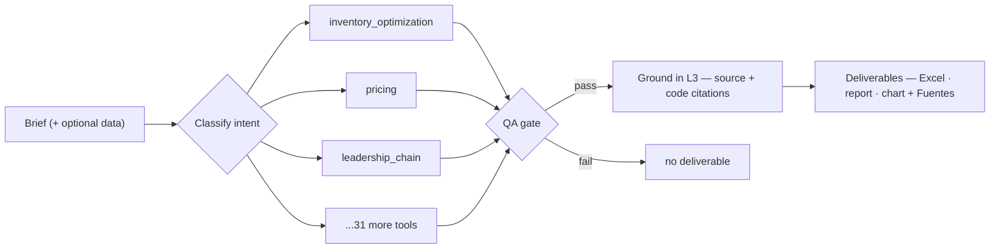
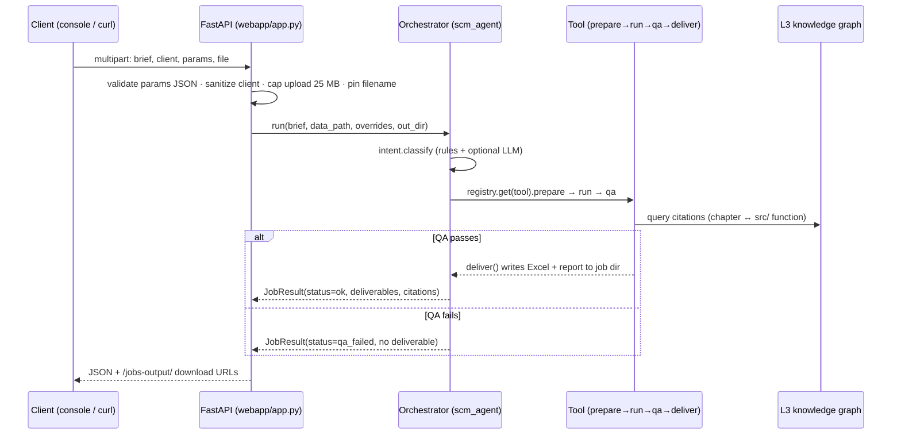

<div align="center">

# 🔗 Kern

### The agentic brain for supply-chain decisions — grounded in the field's best models and sources.

**Kern** (German for *core*) is the evolution of **Linchpin** — from a tool that analyzes to the core the agency's service runs on. The name changed because the role changed: not reports on demand, but the decision kernel every engagement executes through — the QA gate that vetoes bad deliverables, citations to 25 curated sources on every result, staged writeback with rollback, and guided outcomes that always end in a safe human step. [Why Kern →](documentation/KERN_IDENTIDAD_Y_FILOSOFIA.md)

**Kern** turns a plain-language brief into finished, QA-gated supply-chain deliverables. A Python **engine** implements the field's established models across **38 agent-routable capabilities** — EOQ, safety stock, `(s,Q)`/`(R,S)` policies, multi-echelon, simulation, forecasting, pricing, price intelligence (competitor position), DDMRP, ABC-XYZ, sourcing, landed cost, cost-to-serve, S&OP, facility location, DRP, transportation, FEFO, reconciliation, slotting, warehouse layout, vehicle routing and more — and an **orchestrator agent** drives every one of them end to end with a **never-unprotected guarantee** (every result is executed *or* hands you a ready, safe next step) and **safe-staging writeback**. Each result is **grounded** in a knowledge graph of **25 curated SCM sources and the codebase itself**.

[](CHANGELOG.md)
[](pyproject.toml)
[](https://github.com/esstipi-debug/kern/actions/workflows/tests.yml)
[](#)

</div>


<div align="center"><sub>The live agent console (<code>webapp/static/prototype/</code>) talking to the real <code>POST /api/jobs</code>.</sub></div>

---

## ⚡ What it does

Give it a brief; it **classifies → runs → validates (QA) → delivers**. If QA fails, nothing ships.



Every one of the **38 registered tools** below is routed the same way — one `register()` call wires a capability into the same `classify → prepare → run → QA → deliver` pipeline, no special-casing. A few, as a sample:

| Capability | Input | Deliverable |
|---|---|---|
| 📦 `inventory_optimization` | demand CSV/Excel | Excel + report + CSV — forecast → `(s,Q)`/`(R,S)` → budget fit |
| 💲 `pricing` | price/qty CSV/Excel | Excel + report — elasticity → margin-maximizing price |
| 🧭 `leadership_chain` | a brief / scores | radar chart + report — CHAIN leadership profile + directives |
| 🏗️ `warehouse_layout` | params / brief | 3D HTML + layout.json + report — navigable warehouse (building, yard, docks, gates, racks) |

Runs **with or without an LLM**: an optional `LLMProvider` (Claude) sharpens routing and the narrative; the deterministic core works on its own. The whole thing is **1100+ tests**.

---

## 🧰 All 38 capabilities, one router

Every capability below is agent-routable — a brief in, a QA-gated deliverable out — through the exact same pipeline as the four examples above. Source of truth: `build_default_registry()` in [`scm_agent/tools.py`](scm_agent/tools.py); this table is regenerated by hand from it, so if the two ever disagree, trust the code. See the [Capability Expansion Plan](documentation/CAPABILITY_EXPANSION_PLAN.md) for what's still credential-gated (Shopify/Amazon/ERP connectors, voice) rather than agent-routable today.

<details>
<summary><b>📋 The full list, by area (38 tools)</b></summary>

| Area | Tools |
|---|---|
| **Demand & classification** | `abc_xyz` · `forecast` · `whatif` |
| **Inventory & replenishment** | `inventory_optimization` · `newsvendor` · `multi_echelon` · `ddmrp` · `simulation` · `drp` · `odoo_replenishment` (live Odoo ERP read + writeback) · `excel_replenishment` (client planilla read + writeback) |
| **Inventory control & health** | `cycle_count` · `reconciliation` · `excess_obsolete` · `markdown_liquidation` · `fefo` · `data_quality` |
| **Procurement & sourcing** | `sourcing` · `landed_cost` · `acceptance_sampling` |
| **Network & logistics** | `facility_location` · `transportation` · `vehicle_routing` · `warehouse_layout` · `slotting` · `queuing` · `scheduling` |
| **Pricing & finance** | `pricing` · `price_intelligence` (competitor price position, one-shot) · `financial_kpis` · `cost_to_serve` · `learning_curve` |
| **Returns, risk & benchmarking** | `returns` · `risk` · `dea` |
| **Planning cadence & projects** | `sop` · `earned_value` |
| **Leadership** | `leadership_chain` |

</details>

Three cross-cutting guarantees keep the agent safe in production:

- **Never-unprotected** — every result is `EXECUTED` or carries an executable path: ranked options, a prepared handoff (pre-filled PO / email / count sheet), or an escalation. No dead ends.
- **Safe-staging writeback** — changes are computed as a dry-run changeset, gated by risk tier + time-boxed approval, applied idempotently, and fully auditable / `rollback()`-able. The agent never mutates a system of record blindly.
- **Data protection by default** — every upload is validated (size, type, path) and processed in an isolated, auto-purged per-job directory; no secrets are ever committed. Full threat model and controls in [SECURITY.md](SECURITY.md).

---

## 🚀 Quick start

```bash
git clone https://github.com/esstipi-debug/kern
cd kern
pip install -e ".[web]"          # canonical install (engine + web UI). For the engine only, `pip install -r requirements.txt` also works.

# ── The agent: brief in, deliverable out ───────────────────────────────
python examples/run_agent.py --brief "set up reorder points" --data data/sample_demand_portfolio.csv
python examples/run_agent.py --brief "what price maximizes profit" --data data/sample_pricing.csv
python examples/run_agent.py --brief "evaluate our SC leadership" --scores "3 2 3 1 1" --name "Team"

# ── Web UI + live agent console (deps already installed above) ──────────
python -m uvicorn webapp.app:app --reload
#   dashboard       → http://localhost:8000
#   agent console   → http://localhost:8000/console
```

> Set `ANTHROPIC_API_KEY` (and `pip install -e ".[llm]"`) to enable Claude-assisted parsing and narrative — optional.

<details>
<summary><b>📐 Engine CLIs — the models, hands-on</b></summary>

```bash
# EOQ + policies + simulation on sample data
python examples/run_part1_part2.py --simulate

# Fill rate + optimal service level / review period (Ch. 7-8)
python examples/run_part3.py

# Gamma, GSM, newsvendor, KDE, simulation optimization (Ch. 9-13)
python examples/run_part4.py

# All SKUs in one CSV
python examples/run_batch.py

# Demand chart vs policy levels
python examples/plot_inventory.py --product SKU-A

# Full pipeline + exports
python examples/run_complete.py --simulate --export output/summary.csv --excel excel-templates/analysis.xlsx

# Power BI dataset (CSV star schema) — see power-bi/SETUP.md
python examples/build_powerbi_dataset.py --simulate

# Forecast demand from history, then derive the policy (uses sigma_e)
python examples/run_forecast_to_policy.py

# Full chain: source -> forecast -> policy -> budget/MOQ constraints
python examples/run_constrained_plan.py --budget 20000

# Live data: read demand from a SQL database instead of a CSV
python examples/run_sql_source.py

# Client deliverables from any CSV/Excel -> Excel + written report
python examples/run_inventory_job.py --data client_demand.csv --budget 50000 --client "Acme Co"
python examples/run_pricing_job.py   --data sales.csv --client "Acme Co"
```
</details>

---

## 🧠 The agent (`scm_agent/`)

A **registry-based orchestrator**: every capability is a `Tool` with four stages — `prepare → run → qa → deliver` — that the orchestrator drives, enforcing **"QA fails ⇒ no deliverable"** in one place. Adding a capability is one `register()` call; no routing edits.

```
brief ─▶ intent.classify ─▶ registry.get(tool) ─▶ prepare ─▶ run ─▶ QA ─▶ deliver ─▶ JobResult
              (rules + optional LLM)              any of the 38 registered tools
```

- **`scm_agent/`** — `types` · `llm` (Claude / rules fallback) · `registry` · `tools` · `intent` · `orchestrator` · `knowledge` (L3 grounding) · `guided_bridge` (never-unprotected contract via `src/guided.py`)
- **Entry points** — CLI `examples/run_agent.py`, HTTP `POST /api/jobs` (multipart, with downloadable deliverables), and the live console under `webapp/static/prototype/`
- **Statuses** — `ok` · `needs_clarification` · `needs_data` · `qa_failed` · `error`

Full reference: [`scm_agent/README.md`](scm_agent/README.md). The `leadership_chain` capability scores a brief against the **CHAIN** model (Collaborative / Holistic / Adaptable / Influential / Narrative) — an original synthesis, not a reproduction of any single external text.

<details>
<summary><b>🔄 Request lifecycle — <code>POST /api/jobs</code></b></summary>



Example response (`status: ok`):

```json
{
  "status": "ok",
  "tool": "inventory_optimization",
  "confidence": 0.87,
  "summary": "12 SKUs · $44k budget · 3 flagged high-bias · (s,Q) for 9, (R,S) for 3.",
  "deliverables": {
    "report": "/abs/job/inventory_optimization/report.md",
    "excel": "/abs/job/inventory_optimization/inventory_plan.xlsx"
  },
  "download_urls": {
    "report": "/jobs-output/tmp09dw516z/inventory_optimization/report.md",
    "excel": "/jobs-output/tmp09dw516z/inventory_optimization/inventory_plan.xlsx"
  },
  "qa_issues": [],
  "clarifications": [],
  "citations": [
    {"concept": "Safety Stock", "source": "SCM knowledge base", "module": "src/safety_stock.py"}
  ]
}
```

Other statuses return the same envelope with `status` one of
`needs_clarification` · `needs_data` · `qa_failed` · `error` and an empty
`deliverables` map.

</details>

---

## 🧠 L3 — domain knowledge & the theory↔code bridge

Every job is **grounded**: the orchestrator queries a knowledge graph and attaches citations to each result (the **Fuentes** shown in the console). Two graphs, one read-only query surface — [`scm_agent/knowledge.py`](scm_agent/knowledge.py):

- **Domain knowledge graph** ([`knowledge/scm-books/`](knowledge/scm-books/README.md)) — **25 curated SCM sources** (forecasting, pricing, revenue management, inventory, operations, logistics, sustainability, leadership, AI in supply chains): ~1,950 concept nodes with source citations. Committed.
- **Code graph** (`graphify-out/`) — the codebase itself, built with `/graphify`. Gitignored (regenerable).

The **bridge** ties them together: for each cited concept it resolves the `src/` module that implements it, so a deliverable cites the concept **and** the function behind it.

```text
Economic Order Quantity           ->  src/eoq.py
Safety Stock                      ->  src/safety_stock.py
Cost & Service-Level Optimization ->  src/cost_optimization.py
```

Query it directly: `python examples/query_knowledge.py --bridge "newsvendor"` · `--search "fill rate"` · `--explain crostons_method`.

---

## ⚙️ The engine — one question, one lens

The analytical core the agent stands on: a chain of small **pure functions**, each answering one question with one point of view. Every number is simulation-real — no Node, no build step.

<div align="center">


</div>

| The question | Engine | The lens it brings |
|---|---|---|
| *How much do I order?* | `eoq.py` | **Cost balance** — the lot size where ordering cost meets holding cost (+ volume discounts). |
| *When do I reorder?* | `policies.py` | **Trigger & risk** — forecast + costs → `(s,Q)`/`(R,S)`: the reorder point *and* the quantity. |
| *How big a buffer?* | `safety_stock.py` | **Uncertainty** — `z·σ·√τ`, keyed off **forecast error σ_e**, not raw demand spread (the classic mistake). |
| *What service do I actually get?* | `fill_rate.py` | **Realized service** — fill rate β (units served), which stays high even when cycle service α drops. |
| *Is more service worth it?* | `cost_optimization.py` | **Economics** — the service level / review period that minimizes holding + shortage cost, not a rule of thumb. |
| *Spiky or skewed demand?* | `forecasting.py` · `distributions.py` | **Shape-aware** — Croston for intermittent, gamma for skew, exactly where the normal model under-stocks. |
| *Where to hold stock across the network?* | `multi_echelon.py` | **System view** — guaranteed-service placement across stages, not greedy per node. |
| *One perishable shot?* | `newsvendor.py` | **Single period** — the critical ratio `cu/(cu+co)`. |
| *Can't trust the assumptions?* | `simulation_opt.py` | **Empirical** — simulate thousands of demand paths, search `(s,Q,S)` for the real optimum. |
| *Is the plan feasible?* | `constraints.py` | **Operational reality** — MOQ, case packs, shelf-life, and a budget allocator that trims safety stock to fit. |
| *What price maximizes margin?* | `pricing.py` | **Elasticity** — per-SKU price sensitivity → the margin-maximizing markup. |

**Why this beats a spreadsheet**


- **Validated, not assumed** — closed-form policies are cross-checked against Monte-Carlo simulation (`simulation.py`, backorders + lost sales).
- **σ_e, not σ_demand** — safety stock keys off *forecast error*, the only correct dispersion (the #1 inventory mistake in the wild).
- **Shape-aware** — intermittent (Croston) and skewed (gamma) demand are first-class, where a normal-curve sheet silently stocks out.
- **Feasible by construction** — MOQ / budget are constraints, so what ships is buildable, not just mathematically optimal.
- **Pure & composable** — each module is a pure function, the engine validated against reference numeric examples in a 1100+ test suite; the orchestrator chains them without surprises.

### 🖥️ How you see it

The same engine output, read through four lenses in the live dashboard (`/`):

<table>
<tr>
<td width="50%"><br><sub><b>Portfolio</b> — the whole plan + budget gauge, over/under cap at a glance.</sub></td>
<td width="50%"><br><sub><b>SKU Detail</b> — history · forecast · ±σ_e · reorder line, with live what-if sliders.</sub></td>
</tr>
<tr>
<td width="50%"><br><sub><b>Budget Planner</b> — cycle vs. safety allocation as you move the cap.</sub></td>
<td width="50%"><br><sub><b>Forecast Quality</b> — bias spread per SKU; which forecasts to trust.</sub></td>
</tr>
</table>

Sliders **recompute the policy live**; the **agent console** (`/console`) adds the L3 **Fuentes** — the source concept *and* the `src/` function behind each number.

<details>
<summary><b>📖 Module reference — coverage by topic</b></summary>

> Deliverables are grounded across all **25 curated sources** in the knowledge graph, not a single reference.

| Topic | Module | Status |
|--------------|--------|--------|
| Inventory policies | `src/policies.py` | `(s,Q)`, `(R,S)` |
| EOQ + volume discounts | `src/eoq.py` | ✅ |
| Lead time & review period | `src/data_loader.py`, `src/eoq.py` | ✅ CSV + power-of-2 |
| Safety stock | `src/safety_stock.py`, `src/demand_variability.py` | ✅ normal + gamma |
| Simulation | `src/simulation.py` | ✅ backorders + lost sales |
| Stochastic lead time | `src/risk_period.py`, `src/policies.py` | ✅ |
| Fill rate | `src/fill_rate.py` | ✅ |
| Cost optimization | `src/cost_optimization.py` | ✅ |
| Gamma demand | `src/distributions.py` | ✅ |
| Multi-echelon GSM | `src/multi_echelon.py` | ✅ allocation + simulation |
| Newsvendor | `src/newsvendor.py` | ✅ |
| Price optimization | `src/pricing.py` | ✅ elasticity / optimal price / markdown |
| Histograms / KDE | `src/discrete_demand.py` | ✅ |
| Simulation optimization | `src/simulation_opt.py` | ✅ grid R + Ss |
| Batch multi-SKU | `src/batch.py` | ✅ |
| Demand forecasting (front-end) | `src/forecasting.py` | ✅ MA / SES / Croston + σ_e |
| Pluggable data sources | `src/sources.py` | ✅ CSV / DataFrame / SQL (DB-API) |
| Business constraints | `src/constraints.py` | ✅ MOQ / case packs / shelf-life / budget |
| Export | `excel_export`, `powerbi_export` | ✅ |

</details>

<details>
<summary><b>Key formulas</b></summary>

**EOQ** — `Q* = sqrt(2 k D / h)`, `C* = sqrt(2 k D h)`

**Safety stock** — `Ss = z_alpha · sigma_d · sqrt(tau)`  ·  `(s,Q)`: τ = L  ·  `(R,S)`: τ = R + L

**Policies** — `(s,Q): s = dL + Ss, Q = Q*`  ·  `(R,S): S = dL + dR + Ss`

</details>

<details>
<summary><b>Data format & parameters</b></summary>

`data/sample_demand.csv`:

```csv
date,product_id,quantity,unit_cost,lead_time_days
2024-01-01,SKU-A,100,50,7
```

```bash
python examples/run_part1_part2.py --product SKU-B --lead-time 2 --service-level 0.90 --simulate
```

| Flag | Meaning |
|------|---------|
| `--holding-cost` | h (per unit/year) |
| `--order-cost` | k (fixed order cost) |
| `--lead-time` | L (periods) |
| `--service-level` | Cycle service level α |
| `--periods-per-year` | Converts weekly data to D |

</details>

---

## 🏗️ From engine to product

The full chain runs end to end (`examples/run_constrained_plan.py`):

```
data source → forecast (σ_e) → (s,Q)/(R,S) policy → MOQ/case packs → budget fit
src/sources.py   src/forecasting.py   src/policies.py   src/constraints.py
```

- **Pluggable data** (`src/sources.py`) — CSV, in-memory DataFrame, or any SQL database via `SqlDemandSource` (SQLite, Postgres, MySQL). New backends just satisfy the `DemandSource` protocol.
- **Forecasting** (`src/forecasting.py`) — MA / SES / Croston, exposing σ_e, the correct safety-stock dispersion.
- **Constraints** (`src/constraints.py`) — MOQ, case packs, shelf-life caps, and a budget allocator that trims safety stock across the portfolio to fit.
- **Web UI** (`webapp/`) — a 4-tab planner (Portfolio · SKU Detail · Budget Planner · Forecast Quality) + the live agent console, served by FastAPI over the engine. See [webapp/README.md](webapp/README.md).
- **Job-fulfillment layer** (`jobs/`) — turn a client's demand file (any schema) into client-ready Excel + a written report with automated QA. See [jobs/README.md](jobs/README.md).

<details>
<summary><b>Project layout</b></summary>

```
scm_agent/            Orchestrator: brief → classify → tool (38 registered) → QA → deliver
jobs/                 Playbooks (one per tool) + intake/QA/deliverables
src/                  Core engine (EOQ → simulation optimization → forecasting → pricing → ...)
webapp/               FastAPI dashboard + POST /api/jobs + live agent console (static/prototype/)
examples/             CLI workflows (run_agent, parts 1-4, batch, jobs, plots)
tests/                1100+ tests: engine (reference numeric examples) + agent + HTTP layer (traversal/upload guards)
data/                 Sample demand + pricing
documentation/        Guides: Getting Started, FAQ, methodology, capability-expansion plan
docs/                 Design briefs, handoff notes, assets
power-bi/             CSV dataset + M queries + DAX + SETUP.md
.cursor/skills/       Agent skills (Cursor / Claude Code)
.github/workflows/    CI (pytest on 3.11–3.13)
```

</details>

---

## 📚 Docs

| Document | Content |
|----------|---------|
| [Getting Started](documentation/GETTING_STARTED.md) | Setup and first run |
| [Methodology](documentation/METHODOLOGY.md) | Models, assumptions, glossary |
| [FAQ](documentation/FAQ.md) | Common questions |
| [`scm_agent/README.md`](scm_agent/README.md) | The agent reference |
| [Security](SECURITY.md) | Threat model, enforced controls, hardening checklist |
| [Deployment](docs/DEPLOYMENT.md) | Production hardening: env controls, reverse proxy, load notes |
| [MCP Server](docs/MCP_SERVER.md) | Selling read-only analysis access to other AI agents: connecting, key issuance, what's exposed |
