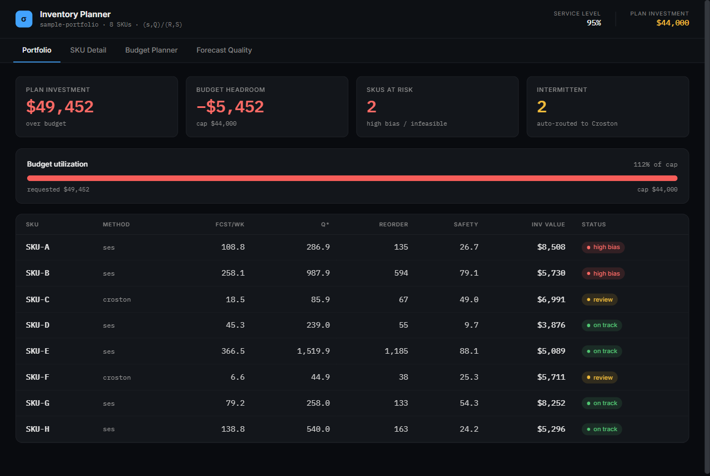
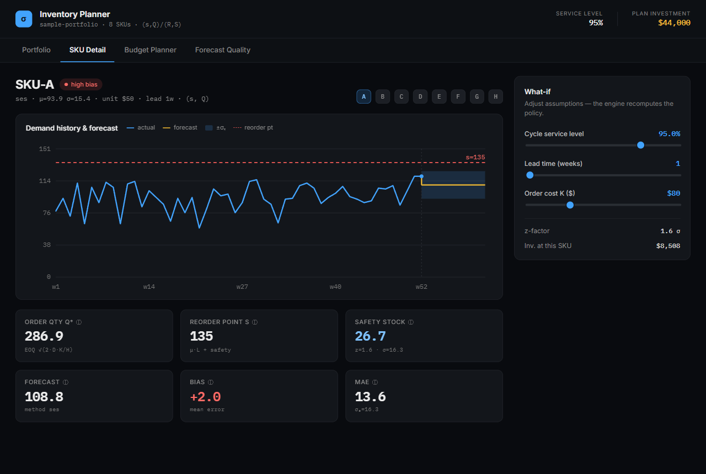
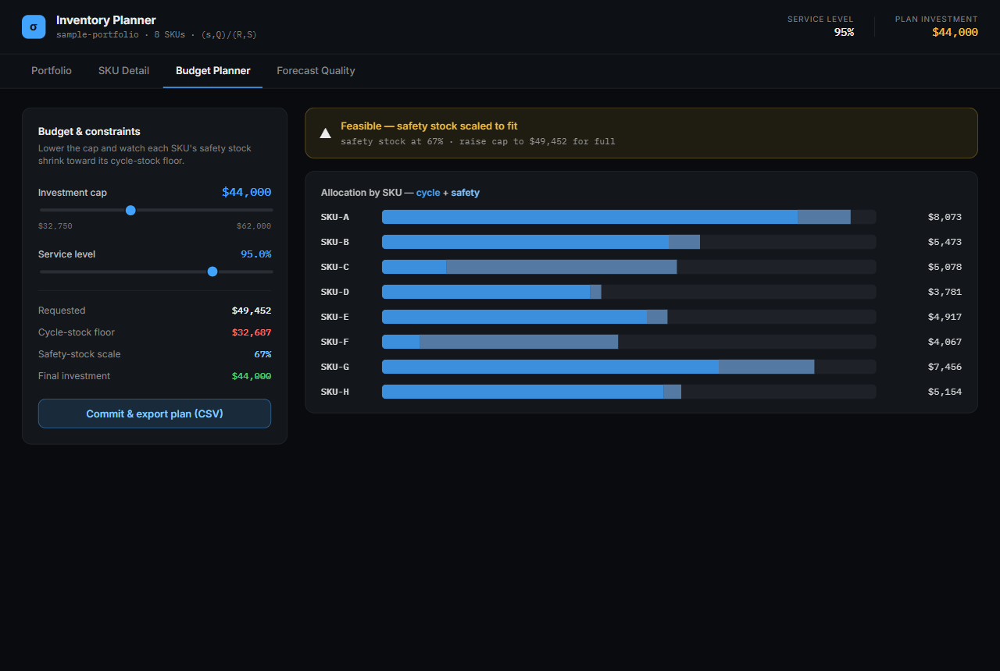
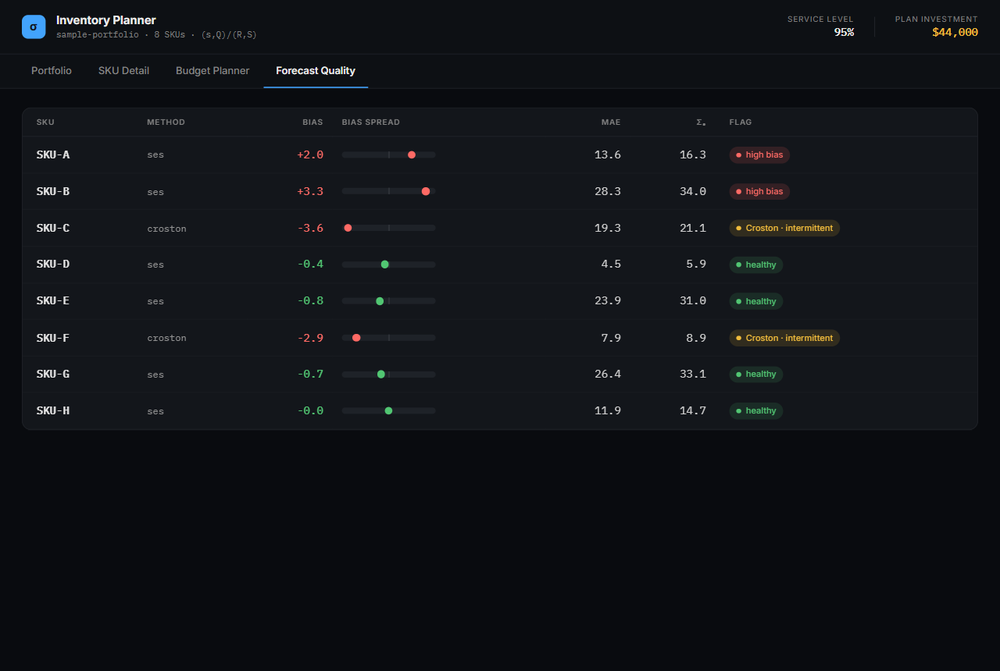

# Inventory Planner — Web UI

A single-page dashboard over the inventory engine, served by FastAPI. Every
number — forecasts, policies, safety stock, budget allocation — comes from
`src/` (forecasting → policies → constraints). No Node, no build step.

## Run

```bash
pip install -r webapp/requirements.txt      # fastapi + uvicorn + engine deps
python scripts/generate_portfolio.py         # writes data/sample_demand_portfolio.csv (one-time)
python -m uvicorn webapp.app:app --reload    # from the repo root
# open http://localhost:8000
```

On Windows use `py -m uvicorn webapp.app:app --reload`.

## Screens

| Tab | What it shows |
|-----|---------------|
| **Portfolio** | KPI cards, budget-utilization gauge, per-SKU table (Q*, reorder, safety, value, status) |
| **SKU Detail** | demand-history + forecast chart with ±σₑ band & reorder line, policy stats with formula tooltips, live what-if sliders |
| **Budget Planner** | budget + service-level sliders, allocation bars (cycle + safety), feasibility banner |
| **Forecast Quality** | bias / bias-spread / MAE / σₑ per SKU, intermittent flagging |

The what-if and budget sliders recompute against the **real engine** (the
backend re-runs the policy + constraint math on each change).






## Architecture

```
webapp/app.py            FastAPI: /api/portfolio runs the engine, serves the page
webapp/static/index.html theme, fonts, root
webapp/static/app.js     vanilla-JS render of the 4 tabs (no framework, no build)
data/sample_demand_portfolio.csv   8-SKU demand (generated by scripts/generate_portfolio.py)
```

`/api/portfolio` accepts `service_level`, `order_cost`, `holding_rate`, `budget`,
and `lead_overrides` (a JSON object) and returns the full portfolio computed by
the engine. The frontend only formats and draws.

## Swap the data source

The backend reads via `CsvDemandSource`. Point it at a live database instead by
swapping in `SqlDemandSource` (see `src/sources.py`) — nothing else changes.
